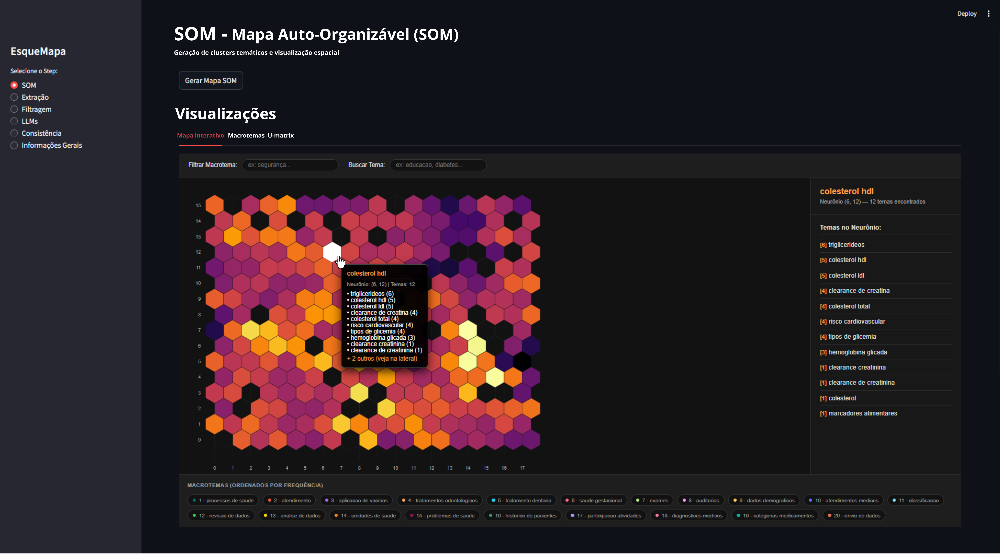

# EsqueMapa: Exploração Temática e Topológica de Esquemas de Bancos de Dados Relacionais

Este projeto implementa um pipeline para explorar e visualizar o conteúdo de um banco de dados PostgreSQL, utilizando Modelos de Linguagem de Grande Escala (LLMs) para identificar tópicos em tabelas e Mapas Auto-Organizáveis (SOM) para agrupar e visualizar esses temas.



## Visão Geral do Pipeline

O sistema é dividido em cinco etapas principais, orquestradas por uma interface Streamlit:

1.  **Extração de Metadados**: Coleta informações detalhadas sobre o schema, tabelas, colunas, chaves primárias/estrangeiras, estatísticas descritivas e amostras de dados de um banco de dados PostgreSQL.
2.  **Filtragem de Metadados**: Filtra os metadados extraídos, removendo tabelas sem dados (com `row_count` igual a 0) e gerando um relatório de filtragem.
3.  **Análise com LLMs**: Utiliza diferentes LLMs (OpenAI, DeepSeek, Mistral) para inferir e extrair tópicos relevantes de cada tabela do banco de dados, com base nos metadados.
4.  **Análise de Consistência**: Avalia a consistência léxica (Hard Dice) e semântica (Soft Dice) dos tópicos gerados pelos diferentes LLMs, tanto intra-modelo (entre execuções do mesmo LLM) quanto inter-modelos (entre diferentes LLMs).
5.  **Geração de Mapa SOM**: Cria um Mapa Auto-Organizável (SOM) para agrupar os temas identificados pelos LLMs em uma estrutura visual e explorável, gerando visualizações como mapas interativos, macrotemas e U-Matrix.

## Requisitos

Para executar este sistema, você precisará:

*   **Python 3.x**
*   **Pip** (gerenciador de pacotes Python)
*   **Acesso a um banco de dados PostgreSQL**
*   **Chaves de API** para os seguintes serviços de LLM (configuradas no arquivo `.env`):
    *   OpenAI (para Step 3 e Step 5 - embeddings)
    *   DeepSeek (para Step 3)
    *   Mistral (para Step 3)

## Configuração

1.  **Clone o repositório (ou descompacte o arquivo ZIP):**

    ```bash
    # Se for um repositório Git
    git clone <URL_DO_REPOSITORIO>
    cd WCCI-V2
    # Se for um arquivo ZIP, você já deve estar no diretório após descompactar
    ```

2.  **Crie e ative um ambiente virtual (recomendado):**

    ```bash
    python3 -m venv venv
    source venv/bin/activate  # No Linux/macOS
    # venv\Scripts\activate   # No Windows
    ```

3.  **Instale as dependências:**

    ```bash
    pip install -r requirements.txt
    ```
    
4.  **Configure as variáveis de ambiente:**

    Crie um arquivo `.env` na raiz do projeto (no mesmo nível de `app_streamlit.py`) com as seguintes variáveis:

    ```dotenv
    PG_USER=seu_usuario_postgres
    PG_PASS=sua_senha_postgres
    PG_HOST=localhost
    PG_PORT=5432 # Ou a porta do seu PostgreSQL
    PG_DB=seu_banco_de_dados
    OPENAI_API_KEY=sua_chave_api_openai
    GEMINI_API_KEY=sua_chave_api_gemini # Opcional, se não for usar Gemini
    MISTRAL_API_KEY=sua_chave_api_mistral
    DEEPSEEK_API_KEY=sua_chave_api_deepseek
    TEMPERATURE=0.0 # Temperatura para os LLMs (0.0 para respostas mais determinísticas)
    ```
    Certifique-se de substituir os valores `seu_usuario_postgres`, `sua_senha_postgres`, `seu_banco_de_dados` e as chaves de API pelos seus próprios.

## Como Usar

Para iniciar a aplicação Streamlit e interagir com o pipeline:

1.  **Execute a aplicação Streamlit:**

    ```bash
    streamlit run app_streamlit.py
    ```

2.  **Navegue pela interface:**

    A aplicação será aberta no seu navegador padrão. No menu lateral (`Sidebar`), você encontrará as opções para navegar entre os diferentes passos do pipeline:

    *   **1. Extração**: Clique no botão para iniciar a extração de metadados do seu banco de dados PostgreSQL configurado.
    *   **2. Filtragem**: Após a extração, esta etapa permite filtrar as tabelas e visualizar um relatório de filtragem.
    *   **3. LLMs**: Nesta seção, você pode rodar os diferentes modelos de linguagem para gerar tópicos para as tabelas. Você pode rodar cada modelo individualmente ou todos de uma vez.
    *   **4. Consistência**: Calcule e visualize a consistência dos tópicos gerados pelos LLMs, com gráficos e interpretações dos resultados.
    *   **5. SOM**: Gere o Mapa Auto-Organizável para visualizar os agrupamentos temáticos. Esta etapa produz um mapa interativo em HTML e imagens com os macrotemas e a U-Matrix.
    *   **Informações Gerais**: Contém uma descrição detalhada do propósito e funcionamento do pipeline.

Siga os botões e instruções na interface para progredir em cada etapa do pipeline. Os resultados intermediários e finais são salvos no diretório `data/` dentro de subdiretórios específicos para cada passo (ex: `data/step1_output`, `data/step5_output`).

---

**Autor:** Allan Miller Silva Lima 
**Data:** 12/04/2026
